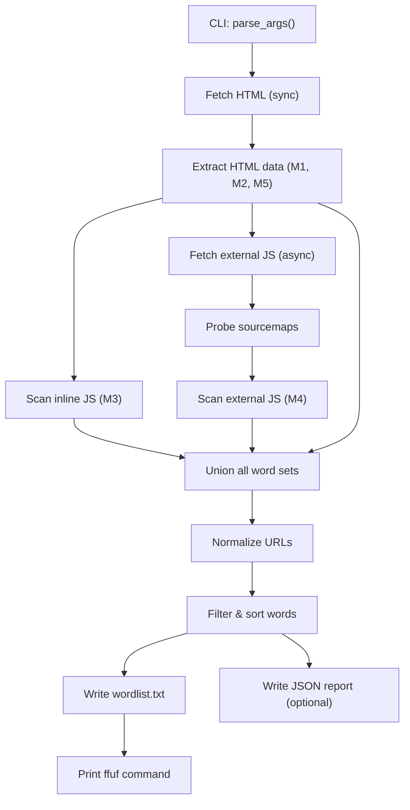

# Spider Spawner

SpiderSpawner is a **context-aware wordlist generator** for web fuzzing. You point it at a single URL, and it scrapes the page, extracts every discoverable path, parameter name, JavaScript string literal, and visible keyword — then writes a deduplicated, sorted wordlist ready for `ffuf`.

## 1. Prerequisites

- Python 3.10+
- (Optional) `ffuf` installed separately for the final fuzzing step.

### Installation

```bash
git clone https://github.com/IcedKraken/spiderspawner.git
cd spiderspawner
pip install -e .
```

## 2. Command-Line Invocation

If installed as a package, you can run it globally:

```bash
spawn <target_url> [options]
```

**Common flags:**

| Flag | Purpose |
|------|---------|
| `-o wordlist.txt` | Output wordlist path (default: `wordlist.txt`) |
| `-j report.json` | Also write a JSON extraction report |
| `-c "session=abc123"` | Cookie string for authenticated scraping |
| `-H "Authorization: Bearer xyz"` | Additional header (repeatable) |
| `-k` | Include visible text keywords (CeWL-style) |
| `--no-external-js` | Skip fetching external JS files |
| `--min-len 3` / `--max-len 50` | Filter words by length |
| `--max-js-size 1048576` | Max JS file size in bytes (default 2MB) |
| `--js-concurrency 5` | Parallel JS fetch limit (default 10) |

## 3. Pipeline — What Happens Step by Step



1. **Fetch HTML:** Downloads the target page synchronously. Supports cookies and custom headers for authenticated sessions.
2. **Extract HTML Data (M1, M2, M5):** Parses the HTML with BeautifulSoup + lxml to collect links, form inputs, hidden values, and visible keywords (if `-k` is set).
3. **Scan Inline JavaScript (M3):** Every `<script>` block is scanned using tiered regex patterns. It detects minification and intelligently recovers path literals, JSON keys, and JSX routes, skipping brittle variable names when minified. Large scripts are chunked to avoid memory exhaustion.
4. **Fetch & Scan External JavaScript (M4):** All external JS files are fetched **in parallel** using `aiohttp`. It probes for source maps (`.map`) to recover full variable names and readable code when available.
5. **URL Normalization:** Processes all collected link strings, discards cross-domain URLs, and extracts query parameters.
6. **Union, Filter, Sort:** Merges all word sets, filters by length, and sorts alphabetically while deduplicating.
7. **Write Output:** Saves the wordlist and an optional JSON report.
8. **Print ffuf Command:** Outputs a ready-to-run `ffuf` automation command.

## 4. Example Usage

```bash
# Basic scan of a public target
spawn https://example.com -o mylist.txt

# With keywords and JSON report
spawn https://example.com -k -j report.json

# Authenticated scan with cookies and custom header
spawn https://example.com/admin -c "PHPSESSID=abc123" -H "X-CSRF-Token: xyz"

# Skip external JS, only use inline JS and HTML
spawn https://example.com --no-external-js

# Increase JS concurrency for fast targets
spawn https://example.com --js-concurrency 20
```

## 5. What You Get

- **Small, high-signal wordlist** — typically 50–500 words for a normal page, compared to 20,000+ from SecLists.
- **Target-specific vocabulary** — paths like `/manage-reports`, parameters like `redirect_to`, API routes from JS bundles.
- **Ready-to-run ffuf command** — no manual assembly.
- **Optional JSON report** — useful for debugging or integrating into larger recon pipelines.

## 6. Important Limitations

| Limitation | Why |
|------------|-----|
| **Single page only** | Not a crawler — no recursive link following. |
| **No JS execution** | Routes rendered only at runtime (e.g., `'/api/' + version + '/users'`) are invisible. |
| **Minified variable names** | Only path literals and JSON keys survive minification; variable names are lost unless a source map is found. |
| **Source maps often missing** | Production deployments frequently omit `.map` files, so SPA route recovery is best-effort. |
